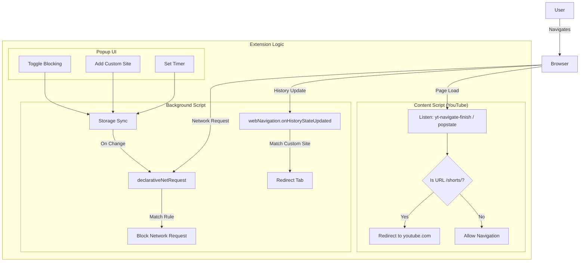

# YouTube Shorts Blocker

A Chrome/Edge extension that helps you stay focused by blocking YouTube Shorts and other distracting websites.

## Features

- **🚫 Block YouTube Shorts**: Automatically redirects YouTube Shorts to the main YouTube homepage.
- **🛡️ Custom Site Blocking**: Add any other websites you want to block (e.g., `twitter.com`, `instagram.com`).
- **⏱️ Temporary Unblock**: Option to temporarily unblock sites for a specific duration.
- **🔄 Sync Across Devices**: Uses Chrome Sync Storage to keep your blocked list and settings synchronized across all your devices.
- **⚡ SPA Support**: Works seamlessly with Single Page Applications (like YouTube) without requiring page reloads.

## How It Works

The extension uses a dual-approach to ensure effective blocking:

1.  **Content Script**: Runs on YouTube to detect client-side navigation (SPA) to Shorts and redirects immediately.
2.  **Background Script**: Uses the `declarativeNetRequest` API for network-level blocking of custom sites and `webNavigation` API as a fallback for history state updates.

### Architecture Diagram

## Installation

1.  Clone or download this repository.
2.  Run `npm install` or `yarn` to install dependencies.
3.  Run `npm run build` to build the extension.
4.  Open Chrome/Edge and navigate to `chrome://extensions`.
5.  Enable "Developer mode" in the top right.
6.  Click "Load unpacked" and select the `dist` folder from this project.

## Development

- `npm run dev`: Watch for changes and rebuild automatically.
- `npm run build`: Build for production.

## Technologies

- **TypeScript**: For type-safe code.
- **React**: For the popup user interface.
- **Tailwind CSS**: For styling the popup.
- **Webpack**: For bundling the extension.
