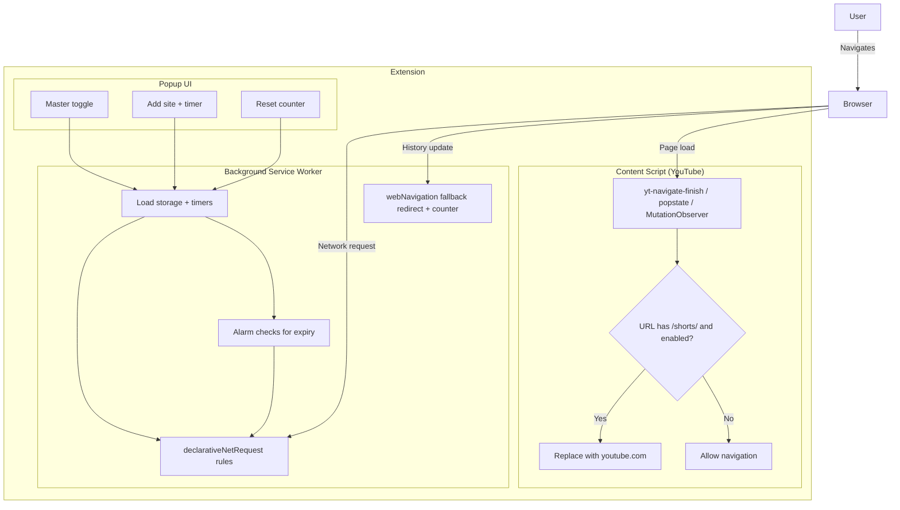

# YouTube Shorts Blocker

A Chrome/Edge extension that keeps you off YouTube Shorts and other distracting sites with a master toggle, redirects, and timed block rules.

## What it does

- Redirects any `youtube.com/shorts/...` visit to the YouTube home page when blocking is on.
- Global master switch pauses/resumes both Shorts redirects and every custom rule.
- Custom blocklist for whole domains or specific paths (for example `x.com` or `youtube.com/shorts`), with per-site toggles and remove.
- Optional timers per site to automatically turn a block off after 15m/1h/4h/1d when adding or updating a site.
- Network-level blocking for custom sites via `declarativeNetRequest`, plus a SPA fallback redirect that also increments the counter shown in the popup.
- Stores settings, timers, and counts in Chrome Sync so the same list follows you across devices (up to 400 custom block rules).

## How it works

- **Content script (YouTube only):** Runs at `document_start`, listens for `yt-navigate-finish`, `popstate`, and URL changes via `MutationObserver`, and replaces Shorts URLs with `https://www.youtube.com` when the master toggle is enabled.
- **Background service worker:** Loads the `enabled` state and saved sites, applies timers with `chrome.alarms`, builds dynamic `declarativeNetRequest` rules for active sites, and uses `webNavigation.onHistoryStateUpdated` as a fallback to redirect SPA navigations to the site root while incrementing `blockedCount`.
- **Popup UI:** Lets you toggle blocking globally, add/remove/toggle sites, attach timers, and reset the counter. Changes are stored in `chrome.storage.sync` and picked up by both the content script and background worker.

### Architecture Diagram

```mermaid
graph TD
    User[User] -->|Navigates| Browser[Browser]

    subgraph Extension
        direction TB

        subgraph Popup["Popup UI"]
            UI_Toggle[Master toggle]
            UI_Add[Add site + timer]
            UI_Reset[Reset counter]
        end

        subgraph Background["Background Service Worker"]
            BG_Load[Load storage + timers]
            BG_Alarms[Alarm checks for expiry]
            BG_DNR[declarativeNetRequest rules]
            BG_Nav[webNavigation fallback redirect + counter]
        end

        subgraph Content["Content Script (YouTube)"]
            CS_Event[yt-navigate-finish / popstate / MutationObserver]
            CS_Check{URL has /shorts/ and enabled?}
            CS_Redirect[Replace with youtube.com]
            CS_Allow[Allow navigation]
        end
    end

    UI_Toggle --> BG_Load
    UI_Add --> BG_Load
    UI_Reset --> BG_Load
    BG_Load --> BG_DNR
    BG_Load --> BG_Alarms
    BG_Alarms --> BG_DNR

    Browser -->|Network request| BG_DNR
    Browser -->|History update| BG_Nav
    Browser -->|Page load| CS_Event

    CS_Event --> CS_Check
    CS_Check -->|Yes| CS_Redirect
    CS_Check -->|No| CS_Allow
```

## Using the popup

- Flip the master toggle to turn all blocking on or off.
- Add a domain or path (for example `tiktok.com` or `youtube.com/shorts`) and pick a duration if you want the block to auto-disable later.
- Toggle or remove any saved site, or set a new timer with the quick buttons or dropdown.
- The counter shows SPA redirects handled by the fallback and can be reset with the button at the bottom.

## Installation

1. Clone or download this repository.
2. Run `npm install` or `yarn` to install dependencies.
3. Run `npm run build` to build the extension into `dist/`.
4. Open Chrome/Edge and navigate to `chrome://extensions`.
5. Enable "Developer mode" in the top right.
6. Click "Load unpacked" and select the `dist` folder from this project.

## Development

- `npm run dev`: Watch for changes and rebuild automatically.
- `npm run build`: Build for production.
