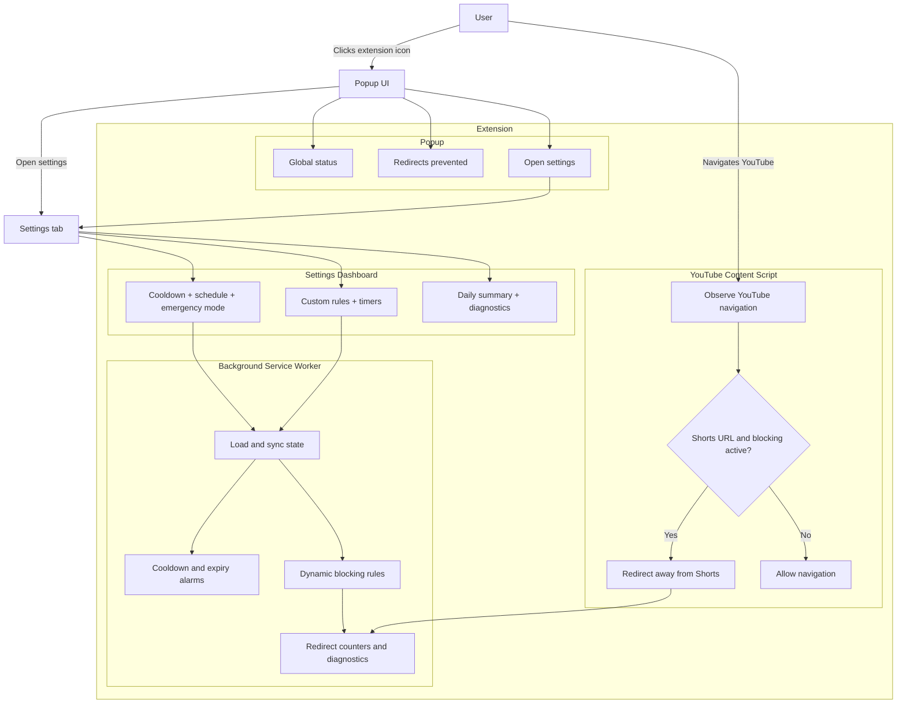

# YouTube Shorts Blocker

A Chrome/Edge extension for blocking YouTube Shorts and other distracting sites with a lightweight popup, a full settings dashboard, timed rules, and focus-hour controls.

> **Looking for system-wide blocking?** [`macos-app/`](macos-app/README.md) contains **ShortBlock**, a native macOS rewrite in Rust with a Liquid Glass UI. It blocks sites at the OS level via `/etc/hosts`, so the block applies to every browser on the Mac — switching browsers no longer bypasses it.

## Current UX

- The extension icon opens a small popup that shows:
  - `Global status`
  - `Redirects prevented`
  - `Open settings`
- `Open settings` launches the full dashboard in a normal browser tab at `settings.html`.
- All configuration lives in the settings tab, not in the popup.

## Features

- Redirects `youtube.com/shorts/...` visits away from Shorts when blocking is active.
- Supports custom rules for full domains or specific paths such as `x.com`, `reddit.com`, or `youtube.com/shorts`.
- Includes multiple rule modes:
  - `Block`
  - `Disable JavaScript`
  - `Smart whitelist`
- Lets you scope rules to:
  - all pages
  - home/feed pages
  - watch pages
  - search pages
- Supports optional timers on custom rules so they can expire automatically.
- Includes a temporary global pause for quick cooldowns.
- Includes a schedule window for focus hours.
- Includes an emergency mode override.
- Tracks blocked redirects and daily totals.
- Shows diagnostics for storage, permissions, active rules, and the last blocking decision.
- Supports import/export for custom rules.
- Persists settings in `chrome.storage.sync`.

## How It Works

- **Action popup:** A compact status surface for quick checks and a fast path into settings.
- **Settings page:** The full dashboard for schedules, cooldowns, custom rules, timers, diagnostics, and summaries.
- **Background service worker:** Maintains extension state, manages alarms for expiring rules and schedule transitions, applies dynamic blocking rules, and records redirect stats.
- **Content script:** Watches YouTube navigation and prevents Shorts loads early in the page lifecycle.

### Architecture Diagram

```mermaid
graph TD
    User[User] -->|Clicks extension icon| Popup[Popup UI]
    Popup -->|Open settings| Settings[Settings tab]

    subgraph Extension
        direction TB

        subgraph PopupSurface["Popup"]
            PopupStatus[Global status]
            PopupCount[Redirects prevented]
            PopupButton[Open settings]
        end

        subgraph SettingsSurface["Settings Dashboard"]
            SettingsControls[Cooldown + schedule + emergency mode]
            SettingsRules[Custom rules + timers]
            SettingsStats[Daily summary + diagnostics]
        end

        subgraph Background["Background Service Worker"]
            BGState[Load and sync state]
            BGAlarms[Cooldown and expiry alarms]
            BGRules[Dynamic blocking rules]
            BGStats[Redirect counters and diagnostics]
        end

        subgraph Content["YouTube Content Script"]
            CSObserve[Observe YouTube navigation]
            CSCheck{Shorts URL and blocking active?}
            CSRedirect[Redirect away from Shorts]
            CSAllow[Allow navigation]
        end
    end

    Popup --> PopupStatus
    Popup --> PopupCount
    Popup --> PopupButton
    PopupButton --> Settings

    Settings --> SettingsControls
    Settings --> SettingsRules
    Settings --> SettingsStats

    SettingsControls --> BGState
    SettingsRules --> BGState
    BGState --> BGAlarms
    BGState --> BGRules
    BGRules --> BGStats

    User -->|Navigates YouTube| CSObserve
    CSObserve --> CSCheck
    CSCheck -->|Yes| CSRedirect
    CSCheck -->|No| CSAllow
    CSRedirect --> BGStats
```

## Using the Extension

### Popup

- Click the extension icon to see whether blocking is currently active.
- Check the running `Redirects prevented` count.
- Use `Open settings` to move into the full dashboard.

### Settings

- Add a website or path to block.
- Choose a rule mode and scope for that site.
- Set an optional timer for temporary blocks.
- Apply a temporary global pause when you need a short break.
- Set a daily schedule window for focus hours.
- Toggle emergency mode when you need to bypass normal blocking behavior.
- Export or import rules.
- Review the daily redirect summary and diagnostics cards.

## Installation

1. Clone or download this repository.
2. Install dependencies with `npm install` or `yarn`.
3. Build the extension with `npm run build`.
4. Open `chrome://extensions` or `edge://extensions`.
5. Turn on **Developer mode**.
6. Click **Load unpacked**.
7. Select the project's `dist` directory.

## Development

- `npm run dev` rebuilds on file changes.
- `npm run build` creates a production build in `dist/`.
- `npm test` runs the Vitest test suite.

## Project Notes

- The popup entry point is `popup.html`.
- The full dashboard entry point is `settings.html`.
- The extension is built with React, TypeScript, Webpack, and Manifest V3.
