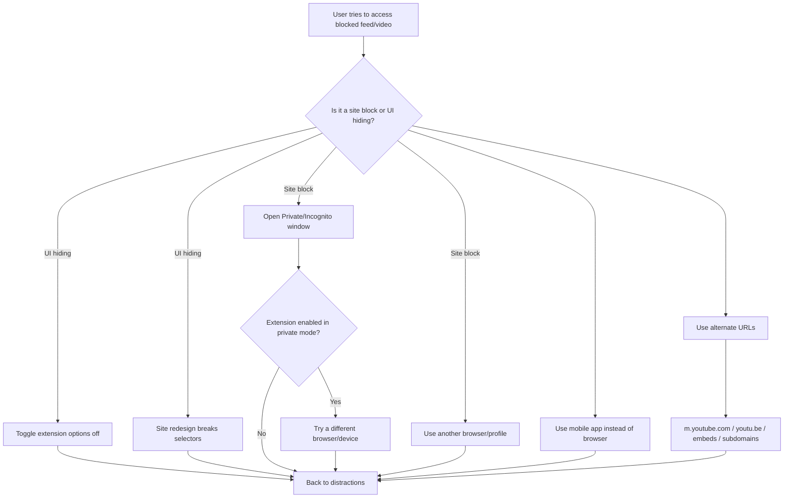

# Browser Extensions That Block Social Media and YouTube Interactions: What Works, What Fails, and Why

## Executive summary

Browser extensions can absolutely reduce doomscrolling and rabbit-hole behavior, but **they cannot reliably “enforce” abstinence** on their own. If you control the browser, you can usually bypass the browser (disable/uninstall extension, use a different profile/browser/device, or use private windows). A real “can’t-bypass-it-at-3am” setup usually requires **OS-level enforcement** or **managed-device policies**, not just an add-on. citeturn15search2turn15search23turn9search25

Within that reality, there are three buckets that actually work in day-to-day life:

**Hard blockers (time budgets / schedules / lockdowns)**
- **entity["people","James Anderson","leechblock developer"]’s LeechBlock NG** is the strongest *pure browser* time-bucket tool in this set: multi-block sets, lockdown, password gates, delays, and whitelists. Users consistently like that it can stop you before the page even loads. citeturn8view0turn3search20  
- **StayFocusd** is widely used and is “strict if you configure it strictly.” It can block sites (and even in-page elements), has a “Nuclear Option,” and uses friction (challenge mode) to reduce impulsive setting-changes. Users still bypass it via private windows unless explicitly enabled there. citeturn15search2turn15search3turn16view0turn15search1  
- **BlockSite** is popular, but **freemium friction + privacy-unease + reliability complaints** show up repeatedly. It works for many people, but it’s not the “tough love” option. citeturn20view0turn8view2turn9search18  

**Soft blockers (make feeds/comments/recommendations disappear while keeping access)**
- **Unhook / Unhook NG** are the most consistently praised *YouTube UI surgery* tools: hiding Shorts, related videos, comments, end screens, and autoplay is exactly what people cite as “it gave me my life back.” Breakage happens when YouTube ships UI changes, but recent reviews show active updates. citeturn18view0turn7view0turn6search2turn6search0  
- **News Feed Eradicator** and **UnDistracted** are the top “remove the feed, keep the utility” tools across multiple platforms. They work well when your goal is: “I still need messages/groups/search, just not the infinite feed.” citeturn2view0turn20view2turn13view0turn19view1turn10search0  
- **entity["people","Steve Fernandez","fb purity developer"]’s Fluff Busting Purity** is brutally effective for cleaning up Facebook, but often breaks when Facebook changes code, and it can be heavy enough to make the site crawl. It’s a power tool—high payoff, higher maintenance. citeturn21view3turn11search18turn11search2  

**“Build your own blockers” (content blockers with rules)**
- **entity["people","Raymond Hill","ublock origin developer"]’s uBlock Origin** is not a “productivity blocker,” but users routinely use it to nuke distracting UI elements, run cosmetic filters, and block scripts. It’s also a magnet for fake copycats, so you must verify you installed the real one. citeturn10search38turn25search5turn25search21turn8view1  

Common failure modes show up across basically every tool:
- **Private windows + other browsers/devices bypass everything** unless you deliberately harden those paths. citeturn15search2turn15search23  
- **DOM/UI changes break element-hiders** (especially Facebook and YouTube). Even extension authors admit some sites are not worth chasing. citeturn24search0turn11search18turn6search2  
- **Misconfiguration locks you out** (e.g., “allowed sites only” mode but you forgot the settings/dashboard URL). citeturn21view4  
- **Freemium limits create “it worked until I hit the paywall” rage-reviews.** citeturn8view2turn20view0  

## How this research was done, and what blocking means in practice

This report prioritizes real-world user feedback from:
- Reviews the **Firefox Add-ons** site surfaces directly (static HTML pages with review text and rating distributions). citeturn7view0turn8view0turn10search2turn23search3  
- **Chrome Web Store** rating distributions and review excerpts as mirrored by a third-party analytics index (because Chrome review text is frequently loaded dynamically and is hard to capture in text-only crawls). citeturn16view0turn18view0turn20view2turn21view4  
- “Reality check” threads from entity["organization","Reddit","social discussion site"], plus major forums like entity["organization","Stack Overflow","programmer q&a"] / entity["organization","Super User","stack exchange tech forum"] and the entity["organization","Opera Forums","web browser forum"]. citeturn15search2turn15search23turn11search6turn9search12  

“Blocking” in extensions usually means one (or more) of:

- **Site blocking:** stop navigation to a domain/path (often fails if you miss subdomains or alternate domains).
- **Element hiding:** remove/replace sections (feed, sidebar, shorts shelf) via CSS selectors or scripts (often breaks when sites redesign UI).
- **Comment blocking:** hide comment containers (easy on static pages, annoying on reactive apps that re-render).
- **Autoplay/video controls:** disable autoplay or hide “Up next” patterns (YouTube changes these often).
- **Lockdown/strictness:** add friction (passwords, timers, challenge mode), but it’s still usually defeatable if you can remove the extension.
- **Scheduling/whitelisting:** only block during certain hours or allow only specific sites.

## Comparative table of extensions and key attributes

Legend (blocking features):
- **SB** site blocking (whole site / url paths)  
- **EH** element hiding (feeds / sidebars / Shorts shelf)  
- **CB** comment blocking  
- **AV** autoplay/video blocking (autoplay toggles, end screens, “Up Next”)  
- **LP** login prevention (rare; usually “no”)  
- **SCH/WL** scheduling / whitelists / allowlists  
- **STR** strictness (friction/lockdown modes)

| Extension | Developer / publisher | Browser compatibility | Blocking features | Ease of setup | Performance impact (reported) | Privacy/security notes | Known bypasses | Pricing model |
|---|---|---|---|---|---|---|---|---|
| LeechBlock NG | entity["people","James Anderson","leechblock developer"] | Firefox desktop + Firefox Android; also available for Chrome-family browsers citeturn8view0 | **SB, SCH/WL, STR** (30 block sets, lockdown, delay, password/access-code gates) citeturn8view0 | Medium (powerful settings UI) | Usually light; failures more often config-related than performance-related (review themes) citeturn3search20 | Host-based blocking means broad power; still an extension (can be removed) citeturn8view0turn3search20 | Other browser/profile; disable/uninstall; private windows depending config (general pattern) citeturn15search2turn15search23 | Free citeturn8view0 |
| StayFocusd | entity["company","Sensor Tower","app analytics company"] (publisher shown in listing) citeturn2view2 | Chrome; works on Edge (Chromium). citeturn2view2turn5search14 | **SB, EH, SCH/WL, STR** (“Nuclear Option,” “Require Challenge,” in-page blocking) citeturn2view2turn15search1turn16view0 | Medium (misconfig can bite) citeturn21view4 | Some users report YouTube lag or timer glitches citeturn16view0 | Needs wide “read/change data” permission to enforce blocks citeturn2view2 | Private windows if not enabled; other browser; uninstall (even if nuclear mode can’t be “canceled” inside the UI) citeturn15search2turn15search23turn15search3 | Free (no in-app purchase flag shown in listing excerpt) citeturn2view2 |
| BlockSite | BlockSite’s team / BlockSite service (blocksite.co) citeturn20view0turn9search6 | Chrome; also available on Firefox and Edge-family setups citeturn9search6turn5search14 | **SB, SCH/WL, STR** (focus mode/schedules, keyword/category options in marketing) citeturn9search6turn20view0 | Easy initially; gets annoying when you hit limits citeturn8view2turn20view0 | Reports range from fine to heavy (CPU/memory complaints exist) citeturn9search0 | Notable user distrust exists; past “potentially dangerous” concerns discussed publicly citeturn9search18turn9search12 | Disable/uninstall; other browser/device; often not “tamper proof” citeturn15search23turn20view0 | Freemium + paid tiers; free tier criticized as severely limited citeturn8view2turn20view0 |
| Unhook | “Unhook” publisher on Firefox; also available on Chrome/Edge citeturn7view0turn18view0 | Firefox desktop + Firefox Android; Chrome-family citeturn7view0turn18view0 | **EH, CB, AV** (Shorts, recommendations, end screens/cards, comments, autoplay, embeds, m.youtube.com) citeturn7view0turn6search5 | Easy (toggle options) citeturn7view0 | Usually light; UI breakage is the main complaint citeturn6search2turn18view0 | Host permissions are limited to YouTube domains (on Firefox) citeturn7view0 | You can just toggle it off; use another browser; YouTube UI can break features until updated citeturn6search2turn15search23 | Free; optional donations referenced on Firefox listing citeturn7view0 |
| Unhook NG | (Newer fork/variant; positioned as “fixes issues from original Unhook”) citeturn6search0turn6search1 | Firefox + Chrome-family citeturn6search0turn6search1 | **EH, CB, AV** (same target: YouTube distractions) citeturn6search0 | Easy | Similar to Unhook: DOM churn is the enemy citeturn6search0turn6search2 | Same class of permissions (YouTube page modification) citeturn6search0 | Toggle off / uninstall / other browser | Free (no pricing flag shown in captured excerpts) citeturn6search0 |
| News Feed Eradicator | entity["people","Jordan West","software developer"] citeturn10search1turn2view0 | Chrome + Firefox citeturn2view0turn10search0 | **EH, SCH** (remove feeds; “snooze”; quotes) citeturn10search0turn20view2 | Easy | Generally light; some regressions after updates mentioned citeturn19view2 | Open-source; donation page explicitly says it’s free citeturn10search1turn10search9 | Toggle off; unsupported sites; some feeds can reappear after navigation citeturn19view2turn20view2 | Free (donations optional) citeturn10search9turn10search1 |
| UnDistracted | “Created by owner of listed website” on Chrome store citeturn13view0 | Chrome; Firefox variants exist (one version outdated; “Main” is current) citeturn13view0turn23search3turn23search1 | **EH, SB** (multi-site hiding; can hard-block entire sites) citeturn13view0turn12search30 | Easy for defaults; advanced filters need tinkering citeturn12search30turn12search26 | Usually fine; some features fail on some setups citeturn23search3turn19view1 | Chrome listing claims no data collection + no history access; uses account sync citeturn13view0 | Toggle settings back on (common self-bypass); other browser/device citeturn12search26turn15search23 | Free + in-app purchases citeturn13view0turn23search4 |
| Fluff Busting Purity | entity["people","Steve Fernandez","fb purity developer"] citeturn11search40turn11search7 | Chrome + Firefox + Edge + Opera + others citeturn11search40turn11search13 | **EH** (Facebook cleanup: ads, reels, “suggested,” filters, etc.) citeturn11search5turn21view3 | Medium-hard (lots of options) | Can be slow/heavy; can stall the site citeturn21view3turn11search6 | History of fake copies being uploaded; must get the real one citeturn11search1turn25search20 | Breaks after Facebook code/UI changes; browser flags/corruption reports appear in forums citeturn11search18turn11search6 | Donationware citeturn11search40turn11search7 |
| uBlock Origin | entity["people","Raymond Hill","ublock origin developer"] citeturn10search38turn25search6 | Firefox + Chromium-family (availability depends on browser policies) citeturn10search38turn25search6 | **SB (network), EH (cosmetic), CB (via filters), AV (indirect)** | Medium (powerful; learning curve) citeturn10search38turn8view1 | Usually improves page load by blocking network junk, but site-specific breakage/YouTube cat-and-mouse shows up in reviews citeturn8view1turn25search1 | Fake copies exist; verify IDs/publisher carefully citeturn25search5turn25search21turn25search20 | Other browser/device; sites may detect/block; wrong filter choices can break pages citeturn8view1turn23search2 | Free + open-source citeturn10search38turn25search6 |
| Hide Comments Everywhere | entity["people","Grant Winney","software developer"] citeturn24search6turn24search5 | Chrome + Firefox citeturn24search6turn24search0 | **CB, SCH/WL** (whitelist/blacklist; toggle per domain) citeturn24search0turn24search5 | Medium (works best if you tune per site) | Light; failures mostly site-specific selector churn citeturn24search5turn24search0 | Author explicitly notes some sites are too volatile (Facebook/Instagram identifiers change frequently) citeturn24search0turn24search9 | Site UI updates; dynamic apps re-rendering content can “re-show” comments until rules updated citeturn24search5turn24search0 | Free/open-source citeturn24search5turn24search6 |
| Shut Up: Comment Blocker | Ricky Romero (publisher listed on Chrome store) citeturn24search8 | Chrome; also described as available on Firefox/Edge/Opera/Safari in tech press citeturn24search20turn24search15 | **CB, SCH/WL** (hide comments by default; allow per site) citeturn24search8turn24search15 | Easy | Light | Open-source CSS base mentioned; intended scope is “websites, not inside apps” (Safari) citeturn24search15turn24search8 | Apps bypass (mobile apps); dynamic comment systems sometimes slip citeturn24search15 | Free citeturn24search15turn24search8 |

### Satisfaction chart

This is a **proxy** using average store ratings (selected extensions). It’s not perfect (ratings are biased, review fraud exists, and “works today” ≠ “works after the next redesign”), but it’s still useful as a high-level signal. citeturn2view3turn16view0turn20view0turn18view0turn19view2turn19view1turn19view3

## What works vs what fails, based on user reviews and forum reports

This section is intentionally blunt: **what people celebrate, what makes them rage-uninstall, and what breaks in real life.**

### LeechBlock NG

What actually works:
- It’s designed around the unpleasant truth: you don’t need a fancy “wellness dashboard,” you need the site to not open. Users highlight that it can **stop a distracted click before the page loads**, which is a meaningful behavioral interrupt. citeturn3search20turn8view0  
- Power-user features (multiple block sets, lockdown, whitelists, delays, passwords/access codes) are explicit in the add-on docs and are what let you tailor “work hours vs weekends” instead of one global hammer. citeturn8view0  

What bites you later:
- Setup depth = setup risk. If you don’t understand your own rules (time periods + time limits + lockdown), you either under-block (pointless) or over-block (you’ll disable it). citeturn8view0  
- Like all browser-only blockers, it’s still defeatable if you can remove it, or just use another browser/profile/device. citeturn15search23turn15search2  

Representative review reality:
- A user praises that it “closes the tab before it can even load,” which is exactly why it’s effective. citeturn3search20  
- Another user explicitly wishes for more “block the settings page” style options—because they recognize the weakest link is *you editing your own rules*. citeturn3search20  

### StayFocusd

What actually works:
- When configured correctly, it’s strict: “Nuclear Option” + “Require Challenge” is basically “make cheating annoying.” citeturn15search1turn16view0  
- It supports in-page blocking, not just whole sites, which matters if you need YouTube for work but not Shorts/comments/recs. citeturn15search1turn2view2  

What fails in the wild:
- **Private windows bypass** is the classic faceplant: users explicitly say they just open a private window and keep browsing. citeturn15search2  
- Misconfig can lock you out: a Chrome Web Store review complains about “Allowed Sites only” mode and not being able to reach the dashboard/settings without reinstalling. That is the kind of foot-gun that makes people ditch it. citeturn21view4  
- Some users report lag on YouTube and timer weirdness (“timer freezes”), which is exactly the kind of “it works… except when it matters” bug that destroys trust. citeturn16view0  

Representative excerpts:
- Private-window bypass is openly admitted: “open an Incognito Mode and continue.” citeturn15search2  
- Recent reviews mention “lag… in YouTube.” citeturn16view0  

### BlockSite

What actually works:
- People use it successfully for “block YouTube / adult sites / distractions,” and it does help some users stop compulsive loops. citeturn20view0turn21view1  
- The vendor feature list advertises schedules, focus mode, cross-device sync, keywords/categories, redirects, etc. citeturn9search6  

What’s a pain:
- **Freemium limitations** are the #1 negativity driver. Firefox reviews read like a broken record: “only blocks six sites” / “cash grab.” citeturn8view2turn9search0  
- Chrome-side reviews also complain the free tier is “severely limited,” pushing paid plans. citeturn20view0  
- Some users complain about performance and CPU/memory impact. citeturn9search0  

Privacy/security concerns that show up in the real world:
- There’s long-standing community suspicion: forum posts accuse it of being spyware; a Firefox subreddit thread discusses it being disabled as violating data practices. These are **allegations and policy outcomes**, not proof of current behavior, but they materially influence user trust. citeturn9search12turn9search18  

Representative excerpts:
- Firefox users: “Only blocks six sites… don’t waste your time.” citeturn8view2  
- Chrome reviews: complaints about mandatory syncing and needing separate subscriptions for different profiles/browsers. citeturn21view1  

### Unhook and Unhook NG

What actually works:
- Unhook’s Firefox listing spells it out: hide homepage feed, sidebar, end screens/cards, comments, shorts tab; disable autoplay; works on mobile YouTube in Firefox Android and on embeds. citeturn7view0turn6search5  
- Chrome Web Store review sentiment is extremely strong: the rating distribution is heavily 5-star, and people explicitly credit it with ending YouTube rabbit holes. citeturn18view0  
- A key benefit vs full site blockers: you can still use YouTube intentionally (search/subscriptions) without being fed algorithmic sludge. Users describe that as the difference between “useful tool” and “I’ll just disable it.” citeturn18view0turn6search21  

What fails:
- UI churn. Firefox reviews literally discuss features being broken when the extension wasn’t updated for a while, and then newer reviews celebrate updates fixing new player behaviors. That’s the core game: the platform changes, the extension plays catch-up. citeturn6search2turn7view0  
- Some options are “too blunt.” One Chrome review complains “hide shorts” hides *all* Shorts (including history/ability to watch), when they only wanted the Shorts button gone. citeturn18view0  
- Confusing controls: a Chrome review says “Not clear how to enable/disable.” That’s small but real. citeturn18view0  

Unhook NG specifically:
- It positions itself as addressing breakage in “original Unhook” and “fixing many issues,” which matches what Firefox reviewers say when calling the original outdated and switching to NG. citeturn6search0turn6search2  

### News Feed Eradicator

What actually works:
- It attacks the highest-leverage addiction surface: the feed. Firefox listing highlights “deletes algorithmic feeds… replaces with a quote,” plus a snooze feature. citeturn10search0  
- Chrome reviews repeatedly say it lets them use social media without the feed “hooking” them, and that it’s “free.” citeturn20view2  
- It’s open-source and explicitly framed as free (donation optional), which correlates strongly with user goodwill. citeturn10search1turn10search9  

What fails:
- Regression complaints after updates + feed reappearing after navigation (classic single-page-app re-render issue). citeturn19view2  
- Coverage gaps: users ask for platforms (e.g., TikTok) that aren’t supported. citeturn21view2  

Representative excerpts:
- Chrome review: “use social media without the feed hooking me.” citeturn20view2  
- Hacker News users explicitly recommend it as a “no main feed” strategy. citeturn10search8  

### UnDistracted

What actually works:
- It’s for people who can’t block social sites outright. The Chrome listing is explicit: hide attention-grabbing elements or fully block the site; settings sync via an account; claims no browsing data collection. citeturn13view0turn19view1  
- The developer describes “Allow: just posts / posts+subs” style modes for Reddit-like platforms—this is the right mental model: **allow use-cases, block feeds.** citeturn12search30  

What fails:
- Users complain about missing timed “block sections for 1 hour” type controls; without time friction, people toggle features back on mid-craving. citeturn12search26  
- On Firefox, there’s explicit confusion and fragmentation: the older add-on has a note saying it’s outdated/not maintained, and a 1-star review says “It doesn’t work on YouTube.” citeturn23search3turn23search1  

Pricing reality:
- Chrome store flags “offers in-app purchases,” and Firefox version history calls out a “paid feature” for gambling/NSFW blocking. citeturn13view0turn23search4  

### Fluff Busting Purity

What actually works:
- It’s a “Facebook makes me miserable, I want it usable” tool. Chrome reviews praise it for filtering ads/sponsored content/reels and generally de-cluttering. citeturn21view3turn11search5  
- Users describe it as essential: “I wouldn’t ever log into FB at all” without it. citeturn20view3  

What’s a pain in the ass:
- Reliance on a moving target. The project itself warns that Facebook code changes can temporarily break filtering. citeturn11search18  
- Performance: a Chrome review describes Facebook grinding to a halt and posts loading one at a time. That kind of performance hit is a deal-breaker for many. citeturn21view3  
- Distribution/legitimacy risk: there’s historic evidence of fake copies being uploaded under similar names, and community threads warn repeatedly about installing the wrong one. citeturn11search1turn25search20  
- Browser-level “this extension may be corrupted/malicious” prompts appear in Opera forum discussions (even if later resolved by updates/workarounds). citeturn11search6turn11search3  

Pricing model:
- Donationware is consistently stated in reference sources. citeturn11search40turn11search7  

### uBlock Origin as a custom “interaction blocker”

What actually works:
- It’s the most flexible “LEGO kit” here: block network calls (ads/trackers), apply cosmetic filters to hide UI, and add custom rules. Users explicitly talk about making YouTube “more usable” with it. citeturn25search6turn8view1  
- It’s widely used and actively developed by its original author. citeturn10search38turn25search6  

What fails / tradeoffs:
- You can absolutely break websites if you get too aggressive (this is why troubleshooting advice frequently says “try disabling extensions like uBlock Origin”). citeturn23search2  
- You must avoid fakes: both Reddit and the project’s issue trackers discuss fake “uBlock Origin” listings and how search results can mislead. citeturn25search5turn25search21  
- Browser policy shifts can affect availability in Chromium-family browsers; users discuss removals/deprecation events and workarounds. citeturn25search16turn25search6  

### Comment blockers

If your “interaction” problem is mostly **comment sections** (doomscrolling fights, rage-replying, etc.), comment blockers can do more than you’d expect.

- Hide Comments Everywhere is clear about how it works: it checks URL → matches known comment containers → injects CSS to hide them. citeturn24search5  
- It also bluntly admits that sites like Facebook/Instagram are too much churn (identifiers change frequently), and the author “stopped trying.” That’s an honest “this scales badly” admission. citeturn24search0turn24search9  
- Shut Up is the simplest model: hide comments by default, allow them when you intentionally choose. Safari distribution explicitly warns it can only hide comments on websites, not inside apps. citeturn24search15turn24search8  

## Privacy, security, and performance realities

This is where most people get burned—either by installing sketchy stuff, or by installing “legit” tools with scary permissions and not realizing the tradeoff.

**Extension permissions aren’t a vibe; they’re power.**
- Some blockers explicitly require broad access to “read and change your data” on sites to enforce blocks or manipulate content. StayFocusd’s listing calls this out directly. citeturn2view2  
- By contrast, YouTube-focused tools can be narrower: Unhook’s Firefox listing shows required permissions limited to youtube domains. Narrow host scope is usually a good sign. citeturn7view0  

**Copycats are a real threat.**
- F.B. Purity users and even the developer warn about fake copies uploaded to stores under similar names. citeturn11search1  
- uBlock Origin has the same issue: multiple threads warn about fake versions using copied icons/names. citeturn25search5turn25search21  

**Performance isn’t theoretical; users feel it.**
- Fluff Busting Purity has reviews describing Facebook becoming unusably slow. citeturn21view3  
- BlockSite has reviews alleging big CPU usage increases in Firefox. citeturn9search0  
- StayFocusd reviews mention lag on YouTube; and some users report timer freezes that let them “slip through.” citeturn16view0  

**A note on Edge compatibility and reviews**
- Edge is Chromium-based and can install extensions from other stores (including Chrome Web Store) via a setting toggle, which means Chrome experiences often translate to Edge in practice. citeturn5search14  
- Third-party trackers also report Edge store metrics for some extensions (example: StayFocusd downloads/ratings). Treat these as directional, not authoritative. citeturn15search16  

## Common bypass vectors and best practices

### Bypass vectors flowchart

This matches what users explicitly admit doing (private windows, other browsers) and what extension authors warn about (site DOM changes). citeturn15search2turn15search23turn24search0turn6search2  

### Best practices that actually hold up

**Decide which problem you’re solving.**
- If you want *abstinence during work hours*: pick a hard blocker (LeechBlock NG / StayFocusd). citeturn8view0turn15search1  
- If you want *intentional use without rabbit holes*: pick a feed/recommendation killer (Unhook, News Feed Eradicator, UnDistracted). citeturn7view0turn10search0turn13view0  

**Harden the obvious bypass paths (or you’re lying to yourself).**
- Enable the extension in private windows where possible (users explicitly bypass by using private mode). citeturn15search2  
- If you routinely “just use another browser,” pick one browser as your only browser and uninstall the rest, or use OS-level tooling. A pure extension can’t stop you from launching Firefox if your block is on Chrome. citeturn15search2turn15search23turn9search25  

**Prefer narrow permissions and trustworthy publishers.**
- For YouTube-only behavior changes, prefer tools that only need YouTube host permissions. citeturn7view0  
- Watch for long-lived projects with transparent code/reputation—and be paranoid about copycats with similar names/icons. citeturn25search20turn11search1turn25search21  

**Expect breakage and choose tools that update.**
- YouTube and Facebook UI changes regularly break element-hiders; that’s normal, not user error. The question is: does the extension update fast enough and do users report it? citeturn6search2turn11search18turn20view3  

**If you need “hard to bypass,” you probably need something beyond a browser extension.**
- Vendors like Cold Turkey explicitly position themselves as “can’t just uninstall.” Whether you trust the claim or not, the direction is correct: enforcement requires deeper hooks than a browser extension usually has. citeturn9search25  

### Explain-it-like-I’m-five

Imagine your brain is a kid in a candy store.

- **YouTube recommendations / social feeds** are the candy aisle. They’re designed so you keep walking and grabbing stuff forever.
- **Unhook / News Feed Eradicator / UnDistracted** are like putting a curtain over the candy aisle, but you can still walk to the milk aisle if you actually need milk.
- **LeechBlock NG / StayFocusd** are like a timer that says: “You can have candy for 10 minutes, and then the door locks.”
- The big problem: **you still have the keys**. You can open a different door (another browser), go to a different store (your phone), or just rip the curtain down (disable the extension).

So the “best” setup is the one where:
1) the candy aisle is covered,  
2) the timer exists, and  
3) you made it annoying to use your keys when you’re impulsive.

### Questions that prove you got the gotchas

1) If you install StayFocusd or LeechBlock NG, what’s the simplest bypass path you need to harden first: **private windows**, **another browser**, or **your phone app**? Why? citeturn15search2turn15search23  
2) Why do “element hiding” extensions (Unhook / FBP / Hide Comments Everywhere) tend to break more often than pure “block this domain” tools? Give a concrete reason tied to how sites are built. citeturn6search2turn24search0turn11search18  
3) In your use case, which is the better tradeoff: **hard block the whole site** or **remove the feed but keep search/messages**? What’s the failure mode of your chosen approach? citeturn10search0turn13view0turn8view0  
4) Name one privacy/security risk that comes from installing the “wrong” extension, and one operational risk that comes from installing the “right” extension with broad permissions. citeturn11search1turn25search21turn2view2