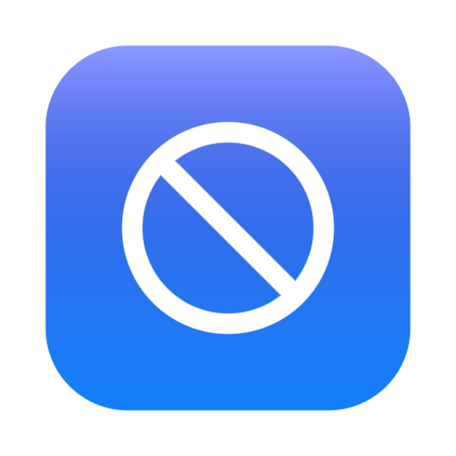

# ShortBlock — system-wide site blocker for macOS

A native macOS rewrite of the YouTube Shorts Blocker browser extension, built in Rust.
Instead of blocking inside one browser, ShortBlock blocks **entire websites at the
operating-system level**, so switching to a different browser doesn't bypass the block.
The UI is a Liquid Glass design: translucent panes rendered over live window vibrancy.

<p align="center"></p>

## How it works

- The Rust backend owns one clearly delimited section of `/etc/hosts`:

  ```
  # >>> ShortBlock managed block — do not edit between markers >>>
  0.0.0.0 youtube.com
  :: youtube.com
  0.0.0.0 www.youtube.com
  :: www.youtube.com
  # <<< ShortBlock managed block <<<
  ```

  Every blocked domain resolves to nowhere for **every browser and app** on the Mac.
  Everything outside the markers is preserved byte-for-byte, and a backup is kept at
  `/etc/hosts.shortblock.bak` before each write.
- Writes go through the standard macOS administrator authentication dialog
  (`osascript … with administrator privileges`) and are followed by a DNS cache flush,
  so changes take effect immediately. Reading the hosts file needs no privileges, so
  the app detects drift for free and only prompts when something actually changes.
- A background loop (every 30 s) handles time-driven transitions — expiring site
  timers, pause expiry, focus-hour boundaries — and re-applies the block list. If you
  cancel the admin prompt it backs off for 30 minutes instead of nagging.

## Menu bar control

ShortBlock lives in the macOS menu bar (a slashed-circle template glyph next to the
clock). From there you can, without opening the window:

- see the current status ("Blocking 4 domains", "On a break until 15:45", …)
- turn blocking on or off
- take a 15-minute or 1-hour break, or resume early
- open the main window, or quit

Closing the main window doesn't quit the app — it keeps running in the menu bar so
timers, focus hours, and breaks keep being enforced. Use "Quit ShortBlock" in the
menu-bar menu to exit (blocks already written to the hosts file stay active until
you turn blocking off).

## Strict sessions

A strict session locks blocking **on** for a chosen duration (1 hour – 24 hours).
While it runs:

- blocking is enforced regardless of the master switch, pauses, or focus hours
- turning blocking off, pausing, disabling a site, or removing a site is rejected
  by the Rust backend (not just hidden in the UI), and the menu-bar menu shows only
  a lock notice
- quitting the app doesn't help — the hosts-file entries stay in place
- there is deliberately no cancel button; starting one requires a confirming
  second click

## Subdomain coverage packs

`/etc/hosts` can't wildcard subdomains, so blocking `youtube.com` alone would leave
`m.youtube.com` reachable. ShortBlock ships coverage packs for popular sites and
applies them automatically: adding `youtube.com` also blocks `m.youtube.com`,
`music.youtube.com`, `youtubei.googleapis.com`, `youtube-nocookie.com`, and
`youtu.be`; adding `x.com` also blocks `twitter.com` and `t.co`; and so on
(Reddit, Instagram, Facebook, TikTok, Twitch, and more — see
`blocker-core/src/coverage.rs`). The packs live in code, not in your saved list,
so they improve with app updates. Each site row shows what else it covers.

## Features carried over from the extension

- Master on/off switch
- Custom block list with per-site enable toggles
- Optional per-site timers (block for 30 min … 24 h)
- Temporary global pause ("take a break") with auto-resume
- Daily focus-hours window, including windows that wrap past midnight
- State persisted at `~/Library/Application Support/ShortBlock/state.json`

What intentionally changed: hosts-level blocking works on whole domains, so
path-scoped rules (`youtube.com/shorts`), the "disable JavaScript" mode, and per-page
redirect counting from the extension don't apply here — blocking a site blocks all of it,
in every browser.

## Project layout

```
macos-app/
├── blocker-core/   # Pure Rust logic: host normalization, schedules, timers,
│                   # hosts-file rendering. No platform deps; fully unit-tested.
├── src-tauri/      # The macOS app: Tauri 2 shell, /etc/hosts engine,
│                   # persistence, background sync loop, window vibrancy.
└── ui/             # Liquid Glass frontend (plain HTML/CSS/JS, no build step).
```

## Building (on a Mac)

Requires Rust (rustup.rs) and Xcode command-line tools.

```sh
cargo install tauri-cli --locked

cd macos-app/src-tauri
cargo tauri dev      # run in development
cargo tauri build    # produce ShortBlock.app + .dmg in target/release/bundle
```

The core logic tests run on any platform:

```sh
cd macos-app/blocker-core
cargo test
```

The app itself is macOS-only by design and refuses to compile elsewhere
(`compile_error!` guard) — the blocking engine and the vibrancy-based design both
depend on macOS.

## Design notes (Liquid Glass)

- The window is transparent with an overlay title bar; the backend attaches an
  `NSVisualEffectView` (`UnderWindowBackground` material, 28 pt corner radius) so the
  desktop shows through, blurred, behind the UI.
- Every surface is a glass pane: `backdrop-filter: blur(28px) saturate(180%)`,
  layered translucent gradients, a specular sweep along the top edge, and hairline
  inner borders — in both light and dark appearance, following the system setting.

## Uninstalling / emergency unblock

Turn the master switch off (removes the managed hosts section), or manually delete
everything between the two ShortBlock markers in `/etc/hosts`:

```sh
sudo nano /etc/hosts
sudo dscacheutil -flushcache && sudo killall -HUP mDNSResponder
```
